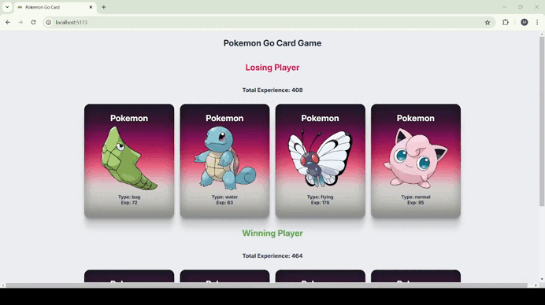

# Pokemon Go Card Game 
🌟In this game, Pokemon cards are randomly shuffled into two hands. Each hand's total experience points are calculated, and the winner is determined. The teams are shuffled with every game session, providing a unique experience each time! 
# Key Features of the project
 This project was a small exercise 

 
✔️To fetch data from an API 

✔️To use props for effective state management 

✔️ To Improve my skills in conditional rendering and to leverage JavaScript methods 
# Preview of the project

